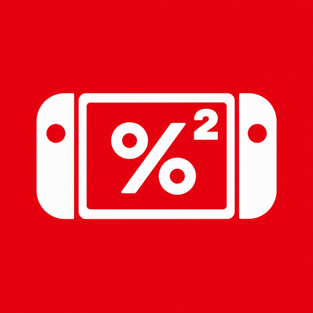

# Switch 할인 트래커 KR

한국 Nintendo eShop 할인 게임을 탐색하고 관심 게임을 기기에 저장하는 Flutter Android 앱입니다.



- 한국 정식 제목 우선 표시, Switch / Switch 2 플랫폼 구분
- 장르 필터, 전체 게임 검색, 인기·할인율·가격·출시일 정렬
- 화면당 20개와 상·하단 이전/다음 페이지 버튼, 스크롤 자동 로딩 없음
- 평소에는 할인 게임만, 검색 시에는 할인하지 않는 게임도 표시
- 할인 탐색에서 현재 판매가 1,000원 이상 5,000원 미만 게임 제외. 검색·관심 게임에는 가격 제한 없이 표시
- 원화 정가·할인가·할인 종료 시간, 최대 30개씩 가격 일괄 조회
- 찜과 마지막 조회 결과 영속 저장, 오류·재시도 지원
- 빨강·흰색만 사용한 단순한 콘솔·가격 화살표 아이콘
- Android 7.0(API 24) 이상 **ARM64(arm64-v8a) 전용** APK

## 개발

Flutter **3.47.6**(Dart 3.13.5), JDK 21, Android SDK 36, Build Tools 36.0.0, NDK 28.2.13676358을 사용합니다. Flutter 버전은 `.flutter-version`에 고정했습니다.

```bash
flutter pub get --enforce-lockfile
flutter analyze
flutter test
flutter run
```

실제 데이터 점검은 선택해서 실행합니다. 일반 테스트는 네트워크 없이 실행됩니다.

```bash
RUN_LIVE_SMOKE=1 flutter test test/live_smoke_test.dart --reporter expanded
```

Codex 클라우드 활성화는 [환경 안내](docs/cloud-setup.md)를 사용합니다. 기존 체크아웃에서 작업하며, 별도 Git worktree는 필요하지 않습니다.

## 현재 공식 데이터 경로

[원본 명세](docs/user-spec.md)의 예전 할인 검색 API는 종료되어 사용하지 않습니다. 앱은 공식 한국 카탈로그 전체를 수집하고, 모든 유효한 NSUID의 한국 가격 확인이 끝난 뒤 결과를 표시합니다.

1. `www.nintendo.com/kr/api/software?sftab=all&spage=N`에서 제목·NSUID·배너·출시일·플랫폼을 수집합니다. 현재 24개 단위이며 동일 출시일의 항목이 페이지 경계에서 중복되거나 빠질 수 있습니다. 최신/오래된 순 및 겹치는 구간을 확인해 **고유한 공식 항목 수가 API의 전체 건수와 같아지는지 검증**합니다. 미완성 목록을 전체 목록으로 저장하거나 표시하지 않습니다. 수집 중 전체 건수가 바뀌거나 확보에 실패하면 이전 저장 결과와 재시도를 제공합니다.
2. `api.ec.nintendo.com/v1/price?country=KR&lang=ko&ids=...`로 중복을 제거한 전체 유효 ID의 실제 원화 가격·할인 기간을 확인합니다. 가격은 최대 30개씩, 목록·가격 요청 모두 최대 4개 동시 요청입니다. 30개는 전송 단위이며 게임 수를 제한하는 값이 아닙니다. 가격이 없는 항목은 무료로 표시하지 않습니다.
3. 기본 화면은 전체 목록 중 현재 할인 게임만 선택하며 **현재 판매가가 1,000원 이상 5,000원 미만인 게임을 제외**합니다. 정가가 아닌 실제 판매가 기준이고 1,000원·4,999원은 제외, 5,000원은 포함합니다. 검색과 관심 게임에는 이 가격 제한을 적용하지 않으며 전체 카탈로그 캐시와 찜을 보존합니다. 제외 후 할인율(실제 가격 비율), 가격, 출시일 또는 인기순으로 **전체 결과를 정렬한 후 20개씩 페이지로 분할**합니다. 페이지 이동은 네트워크 요청 없이 이루어지며, 정렬·장르·검색을 바꾸면 첫 페이지로 돌아갑니다. 같은 값은 제목·ID로 순서를 고정합니다.
4. 검색은 같은 전체 카탈로그에서 한국어·영어 제목을 찾습니다. 띄어쓰기·문장 부호·대소문자를 정규화하고 페르소나/Persona, 포켓몬/Pokémon 등의 시리즈 별칭을 처리합니다. `페르소나` 검색에 3·4·5 시리즈가 함께 표시되고 할인하지 않는 게임도 포함합니다. 공식 한국어 제목을 우선하며 기존에 같은 NSUID로 확인한 한국어 제목 캐시도 사용합니다. 영어만 있는 공식 이름은 임의로 번역하지 않습니다. 유효한 NSUID가 없는 예정작은 제외합니다.
5. 인기순은 [닌텐도 미국 공식 Best Sellers](https://www.nintendo.com/us/store/games/best-sellers/) 공개 목록의 순서이며 화면에 미국 기준을 표시합니다. 전체 카탈로그에 같은 NSUID, 정확한 제품명과 플랫폼, 또는 검증된 지역 제목 별칭으로 순위를 연결합니다. 에디션·플랫폼을 임의로 합치지 않습니다. 순위 미확인 게임은 뒤에 두고 할인율·제목·ID로 정렬합니다. 조회 실패 시 저장 순위를 유지합니다.

전체 결과는 한 번에 기기에 저장합니다. 기존 버전의 일부 목록 캐시는 전체 목록으로 취급하지 않으며 찜은 그대로 유지합니다. 시작/복귀 시 전체 가격 결과는 15분간 재사용하고, 오래된 가격만 갱신할 때 전체 게임 메타데이터는 최대 24시간 재사용합니다. 수동 새로고침은 목록부터 가격까지 다시 수집합니다. 첫 조회 및 전체 새로고침은 수천 개의 목록을 확인하므로 몇 분 걸릴 수 있습니다. 목록·가격 확인, 인기 목록 조회, 찜 저장 중에는 전체 화면에 로딩 상태를 표시하고 검색·정렬·페이지·내비게이션·뒤로 가기 등 앱 내 조작을 차단합니다. 성공/실패 시 차단을 해제합니다.

카탈로그가 장르를 생략하면 알려진 시리즈의 보수적 장르 분류를 보완합니다(`genre_catalog.dart`). 확인할 수 없는 게임은 **미분류**로 표시합니다. API가 제공하는 장르는 우선 사용합니다.

## 서명 및 ARM64 APK

최초 한 번만 앱 전용 키를 생성합니다. 키는 체크아웃 밖에, `android/key.properties`는 Git에서 제외하여 저장합니다. 기존 키를 새 키로 바꾸지 마세요. 동일 키가 있어야 이후 APK를 업데이트 설치할 수 있습니다.

```bash
python3 tool/create_signing_key.py
bash tool/build_release.sh
```

빌드 스크립트는 분석·테스트 후 `flutter build apk --release --target-platform android-arm64 --split-per-abi`를 실행합니다. 디버그 키로 릴리스를 서명하지 않으며, 네이티브 ABI·APK 서명을 검사하고 SHA-256 파일을 생성합니다. 결과는 `dist/switch-sale-tracker-kr-arm64-v1.2.1.apk`와 `.apk.sha256`입니다. 기존 1.0.0·1.1.0·1.2.0과 같은 키로 서명하고 버전 코드를 올려 찜·캐시를 유지한 업데이트 설치를 지원합니다. 다른 CPU용 라이브러리가 없어 범용 APK보다 작습니다. 32비트 전용 기기·x86 에뮬레이터에서는 설치할 수 없습니다.

CI는 PR·main에서 분석·테스트합니다. 수동 실행하는 `release.yml`을 사용하려면 저장소 **Settings → Secrets and variables → Actions**에 동일 릴리스 키의 다음 값을 안전하게 등록해야 합니다.

- `ANDROID_KEYSTORE_BASE64`: 키스토어 파일의 base64
- `ANDROID_KEYSTORE_PASSWORD`: 키스토어 비밀번호
- `ANDROID_KEY_PASSWORD`: 키 비밀번호(생성 스크립트의 PKCS12 키에서는 같은 비밀번호)

키스토어와 비밀번호는 별도로 안전하게 백업하세요. 코드·PR·릴리스에 포함하지 마세요. 자동 배포는 이미 존재하는 버전을 덮어쓰지 않습니다.

## 데이터 및 개인정보

로그인, 자체 서버, 광고, 분석 SDK를 사용하지 않습니다. 관심 목록과 캐시는 기기에 저장됩니다. Android 권한은 인터넷뿐입니다. Nintendo 공식 서버에서 목록·가격을, 공식 카탈로그가 지정한 CDN에서 이미지를 조회합니다. 가격은 변동될 수 있으므로 구매 전 공식 스토어에서 확인해 주세요.

Nintendo와 제휴하지 않은 팬 앱입니다. Nintendo Switch 및 관련 상표는 Nintendo의 자산입니다.
